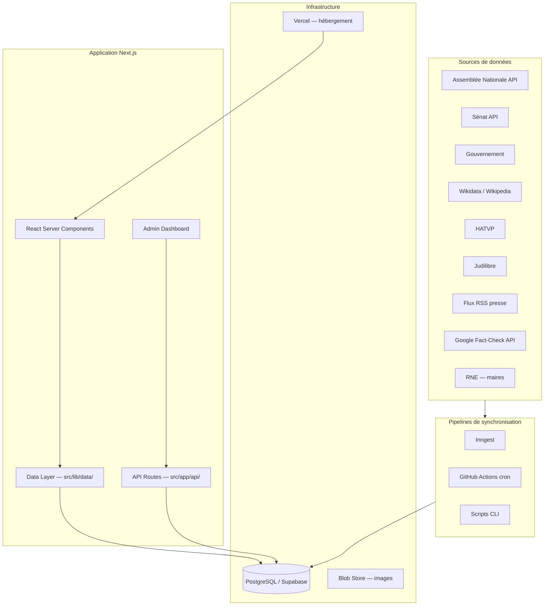
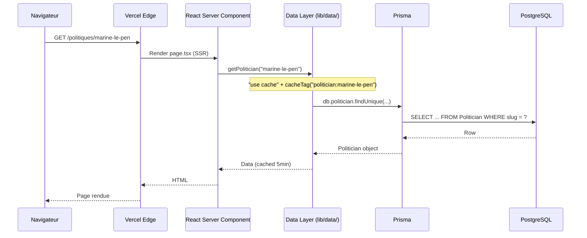
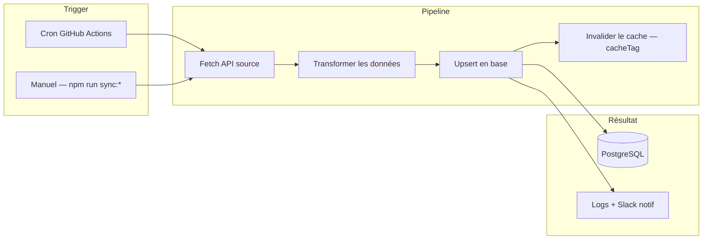
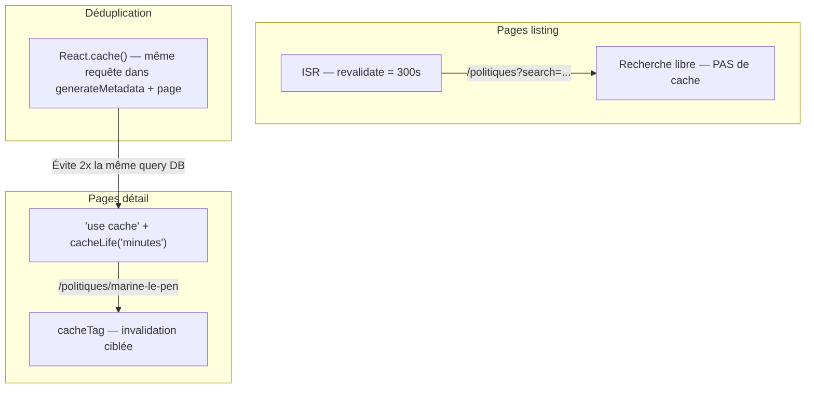
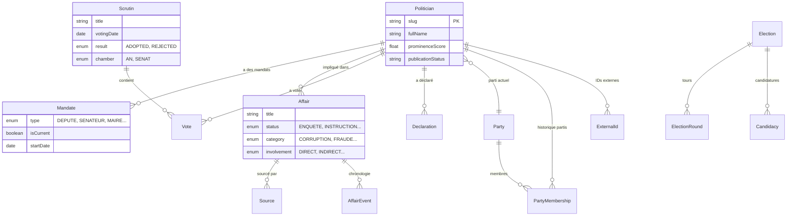

# Architecture technique

> **Dernière mise à jour**: 2026-03-01

---

## 1. Vue d'ensemble

Poligraph est un observatoire civique qui agrège des données publiques sur les politiques français. L'architecture suit un pattern **SSR-first** avec Next.js App Router, un **data layer cacheable** via Prisma, et des **pipelines de sync asynchrones** via Inngest.



---

## 2. Stack technique

| Composant | Technologie | Version |
|-----------|------------|---------|
| Framework | Next.js (App Router) | 16.x |
| Langage | TypeScript (strict) | 5.x |
| Base de données | PostgreSQL | 16+ |
| ORM | Prisma | 7.x |
| UI Components | shadcn/ui + Radix | - |
| Styling | Tailwind CSS | 4.x |
| Charts | D3.js (SVG) | 7.x |
| Tests | Vitest + React Testing Library | - |
| Hébergement | Vercel | - |
| BDD managée | Supabase (PostgreSQL) | - |
| Jobs async | Inngest | - |
| CI | GitHub Actions | - |

---

## 3. Structure du projet

```
src/
├── app/                    # Next.js App Router
│   ├── politiques/         #   Fiches et listes politiciens
│   ├── affaires/           #   Affaires judiciaires
│   ├── partis/             #   Partis politiques
│   ├── votes/              #   Scrutins parlementaires
│   ├── statistiques/       #   Dashboard statistiques
│   ├── comparer/           #   Comparateur
│   ├── elections/          #   Élections (municipales 2026...)
│   ├── admin/              #   Dashboard admin (auth HMAC)
│   └── api/                #   Routes API (admin + public)
│
├── components/             # Composants React
│   ├── ui/                 #   Primitives shadcn/ui (Button, Card...)
│   ├── layout/             #   Header, Footer, Navigation
│   ├── politicians/        #   Cartes, filtres, profils politiciens
│   ├── affairs/            #   Timeline, détails affaires
│   ├── stats/              #   Charts (DonutChart, HorizontalBars...)
│   ├── votes/              #   Badges, cartes scrutins
│   ├── elections/          #   Municipales, countdown, cartes
│   ├── compare/            #   Comparaison côte-à-côte
│   ├── search/             #   Recherche globale (Cmd+K)
│   ├── admin/              #   Formulaires admin, éditeurs
│   └── seo/                #   JsonLd, SeoIntro
│
├── config/                 # Configuration et constantes
│   ├── labels.ts           #   150+ enum → label français
│   ├── wikidata.ts         #   Q-IDs connus (partis, positions)
│   └── colors.ts           #   Couleurs partis et thèmes
│
├── lib/                    # Utilitaires et couche données
│   ├── data/               #   ⭐ Data layer (requêtes cachées)
│   │   ├── politicians.ts  #     getPolitician, getPoliticianForComparison
│   │   ├── affairs.ts      #     getAffairs, getAffairsFiltered
│   │   ├── parties.ts      #     getParty, getPartyLeadership
│   │   ├── declarations.ts #     getDeclarations, getDeclarationStats
│   │   └── municipales.ts  #     getMaires, getMaireStats
│   ├── api/                #   Clients API externes (Wikidata, RSS...)
│   ├── social/             #   Auto-post Twitter/Bluesky
│   ├── cache.ts            #   invalidateEntity(), cacheTag helpers
│   ├── db.ts               #   Prisma singleton (pg pool)
│   └── utils.ts            #   Helpers (formatDate, slugify...)
│
├── services/               # Logique métier
│   ├── sync/               #   Services de synchronisation (30+ fichiers)
│   ├── affairs/            #   Enrichissement, modération, matching
│   └── chat/               #   Chatbot RAG (patterns, embeddings)
│
├── inngest/                # Jobs asynchrones Inngest
│   └── functions/          #   Pipelines : sync, social, IA
│
├── types/                  # Types TypeScript partagés
└── generated/prisma/       # Client Prisma auto-généré (NE PAS ÉDITER)
```

---

## 4. Flux de données

### 4.1 Cycle de vie d'une requête utilisateur



### 4.2 Pipeline de synchronisation



### 4.3 Stratégie de cache



---

## 5. Modèle de données (simplifié)



---

## 6. Patterns clés

### 6.1 Data Layer (`src/lib/data/`)

Toutes les requêtes DB passent par le data layer. Les pages importent depuis `@/lib/data/*`, **jamais** depuis `@/lib/db` directement.

```typescript
// src/lib/data/politicians.ts
export const getPolitician = cache(async function getPolitician(slug: string) {
  "use cache";
  cacheTag(`politician:${slug}`, "politicians");
  cacheLife("minutes");
  return db.politician.findUnique({ where: { slug }, include: { ... } });
});
```

### 6.2 Cache — 3 niveaux

| Niveau | Quand l'utiliser | Exemple |
|--------|-----------------|---------|
| `"use cache"` + `cacheLife("minutes")` | Pages détail, params bornés | `getPolitician(slug)` |
| `revalidate = 300` (ISR) | Pages listing avec search | `/politiques?page=2` |
| `React.cache()` | Déduplication dans un même render | `generateMetadata()` + `page()` |

**Règle d'or** : ne JAMAIS mettre `"use cache"` sur une fonction avec un paramètre `search` libre (cache explosion).

### 6.3 Admin Auth

Toutes les routes API admin utilisent le wrapper `withAdminAuth()` :

```typescript
// src/app/api/admin/affairs/route.ts
import { withAdminAuth } from "@/lib/api/with-admin-auth";
export const POST = withAdminAuth(async (req) => { ... });
```

### 6.4 Labels et i18n

Les enums Prisma sont traduits via `src/config/labels.ts`. Ne jamais hardcoder un label français :

```typescript
import { AFFAIR_STATUS_LABELS } from "@/config/labels";
const label = AFFAIR_STATUS_LABELS[affair.status]; // "Enquête préliminaire"
```

---

## 7. Zones de contribution

| Zone | Difficulté | Description |
|------|-----------|-------------|
| `src/components/ui/` | Facile | Composants shadcn/ui, amélioration visuelle |
| `src/config/labels.ts` | Facile | Labels, traductions manquantes |
| `tests/` | Facile | Tests unitaires (beaucoup de composants non testés) |
| `src/components/stats/` | Moyen | Charts et visualisations |
| `src/components/politicians/` | Moyen | Composants profil politicien |
| `src/app/*/page.tsx` | Moyen | Pages publiques |
| `src/lib/data/` | Avancé | Couche données + caching |
| `scripts/` | Avancé | Scripts de synchronisation (APIs externes) |
| `src/services/sync/` | Avancé | Pipelines de sync |

---

## 8. Commandes de développement

```bash
# Développement
npm run dev              # Serveur dev (localhost:3000)
npm run setup            # Bootstrap complet (Docker + deps + seed)

# Qualité
npm run lint             # ESLint
npm run typecheck        # TypeScript strict
npm run format           # Prettier
npm run test:run         # Vitest (316 tests)

# Base de données
npm run db:studio        # Explorer visuellement la BDD
npm run db:push          # Appliquer les changements de schéma
npm run seed:fixtures    # Charger des données de test
```

---

## 9. Sécurité

- **Auth admin** : HMAC token en cookie HTTP-only
- **CSP** : Content-Security-Policy strict (pas de `unsafe-eval` en prod)
- **Données** : uniquement des données publiques, pas de tracking visiteurs
- **Présomption d'innocence** : champs judiciaires default au plus conservateur (`involvement: "MENTIONED_ONLY"`)
- **Factchecks** : whitelist de sources francophones (`FACTCHECK_ALLOWED_SOURCES`)
